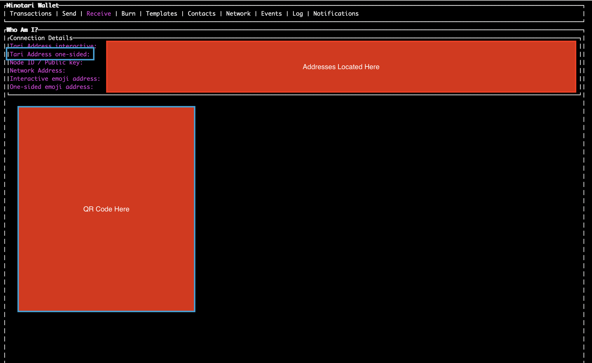

- [Introduction](#introduction)
- [Proposed Integration Structure](#proposed-integration-structure)
- [MinoTari Versions & Release Methodology](#minotari-versions--release-methodology)
- [Setting up Minotari](#setting-up-minotari)
  - [Download the Minotari Binaries and Set Up Your Base Node](#section-1-download-the-minotari-binaries-and-set-up-your-base-node)
- [Create and Configure your Wallets](#create-and-configure-your-wallets)
  - [Creating the Deposit/Main Wallet](#section-2-creating-the-depositmain-wallet)
  - [Obtain the addresses of the Deposit/Main wallet](#section-3-obtain-the-addresses-of-the-depositmain-wallet)
  - [Setting Up a Read-Only Wallet to Monitor for Transactions and Receive Deposits](#section-4-setting-up-a-read-only-wallet-to-monitor-for-transactions-and-receive-deposits)
  - [Configuring the read-only wallet](#section-5-configuring-the-read-only-wallet)
  - [Listening for incoming transactions](#section-6-listening-for-incoming-transactions)
- [Descriptions of Common Activities](#descriptions-of-common-activities)
  - [Receiving funds / User Deposits](#receiving-funds--user-deposits)
  - [Performing withdrawals](#performing-withdrawals)
  - [Confirming Deposits and Withdrawals](#confirming-deposits-and-withdrawals)
- [Payment Reference (PayRef) Integration](#payment-reference-payref-integration)
  - [What are Payment References?](#what-are-payment-references)
  - [How PayRefs Work](#how-payrefs-work)
  - [PayRef Integration Examples](#payref-integration-examples)
    - [Section 9: Verifying Customer Deposits with PayRefs](#section-9-verifying-customer-deposits-with-payrefs)
    - [Implementation Example](#implementation-example)
    - [Customer Support Workflow](#customer-support-workflow)
    - [Section 10: Automated PayRef Processing](#section-10-automated-payref-processing)
  - [Best Practices for Exchanges](#best-practices-for-exchanges)
    - [Security Considerations](#security-considerations)
    - [Customer Experience](#customer-experience)
    - [Integration Checklist](#integration-checklist)
    - [PayRef Customer Support Templates](#payref-customer-support-templates)
      - [Email Templates](#email-templates)
    - [Error Handling and Edge Cases](#error-handling-and-edge-cases)

# Introduction
In this guide, we will cover the details of exchange integration, including:

- The proposed configuration, transaction flow and structure of the integration.
- The release methodology and the distinction between our production, testing and development chains. 
- Setting up a MinoTari node and the wallets required to operate an exchange.
- Configuring the node and wallets for exchange use in common scenarios.
- The Tari Address structure and validating Tari Addresses
- How to create unique addresses for your customers to deposit funds without requiring individual user wallets.
- How to monitor for blockchain for transactions.
- How to use Payment Reference for deposit and transaction confirmation
- An explanation of transaction information returned by the available gRPC methods

> Note: while references to GRPC methods and code examples will be provided here, readers should refer to the [API GRPC Explanation](./API_GRPC_Explanation.md) guide for a full breakdown of the available gRPC methods and their implementation.

This guide assumes that the node will not be used for mining.

# Proposed Integration Structure
Below is the proposed structure of the integration.


* A cold wallet that is the primary wallet for storage of deposit funds. This wallet should be airgapped to be kept entirely separate of the online infrastructure. This is the **Main Wallet** 
* A read-only hot wallet that is used to monitor for incoming transactions to the exchange. This uses the private view key and public spend key from the cold wallet. This is the **Monitoring Wallet** that scans for incoming transactions.
* A **MinoTari base node**. This provides access to the full blockchain on the exchange and removes the reliance on third-parties or public nodes.
* A third, optional hot wallet used for withdrawals. This would be filled periodically with funds transferred from the main wallet, removing the need for the **Main Wallet** to be used for user withdrawals. 

This provides a reasonable environment for monitoring for user deposits and withdrawals.

# MinoTari Versions & Release Methodology

MinoTari has three different networks:
- **Mainnet**: This is the main network.
- **NextNet**: This is the test network, and should be used for testing and development.
- **Esmeralda**: A development network with a deliberately low difficulty target for mining. However, due to frequent resets, should only be used for localised, rapid testing scenarios that don't rely on a large amount of historical data.

MinoTari releases follow the below methodology, and you should use the version appropriate to the network that you are interested in.
 
- **Mainnet (Stable)**: no suffix, e.g. v2.0.1 (example; always verify the latest) 
- **Nextnet (Release Candidate)**: suffix -rc.#, e.g. v2.0.1-rc.0 
- **Esmeralda (Pre-Release)**: suffix -pre.#, e.g. v2.0.1-pre.0 

Example Convention: 
- 4.2.0 → Mainnet
- 4.2.0-rc.0 → Nextnet
- 4.2.0-pre.0 → Esmeralda 

Official binary releases can be found on the GitHub project release page at [github.com/tari-project/tari/releases](github.com/tari-project/tari/releases)

# Setting up Minotari
You will require the following CLI tools from the release to set up MinoTari:
- `minotari_node`
- `minotari_console_wallet`

You will need a Minotari node with gRPC methods enabled. While it is possible to use a public node with the correct gRPC methods exposed, it is recommended that you run your own node for full control and auditability.

> Note: For all servers connected to the internet, they must either be running a Tor client or configure their public IP information. Documentation on this is available [here](https://github.com/tari-project/tari#README) and [here](https://github.com/tari-project/tari/discussions/6366). If you are running on Linux, the Tari applications have built-in Tor support, so this can be ignored.

# Section 1: Download the Minotari Binaries and Set Up Your Base Node 

> NOTE: If you are using a public Minotari node, you can skip this section. Note that you will need the `public key` and the `public address` of the public node in question in order to correctly proceed with this exchange guide.

The latest version of Minotari can be found here: [https://github.com/tari-project/tari/releases](https://github.com/tari-project/tari/releases). Exchanges interested in the build process can review the associated GitHub Actions for the `Build Matrix of Binaries`.

2. Use the instructions here to [install the binaries](https://github.com/tari-project/tari?tab=readme-ov-file#installing-using-binaries).

> NOTE: Depending on your environment, the location of the installed files will likely change. For Mac and Linux, you will likely find it in your Home directory in a `.tari` folder. It may be hidden, in which case you will need to change your settings to be able to view hidden files. On Windows, it will install on in the location you specified during the installation process. To have Minotari create the folder in a specific location, you can use the `--b` path command. Note that you will require this command going forward if you are not using the default folder.

The following binaries will be available.

* **minotari_console_wallet**
* minotari_merge_mining_proxy
* minotari_miner
* **minotari_node**
* randomx-benchmark
* randomx-codegen
* randomx-tests

The two required for the exchange are the **minotari_node** and **minotari_console_wallet**

3. Start the node (consecutive runs): 
```
./minotari_node
```

This can be run with a number of different arguments. The most notable are `--help` and `-b ./path`, where you specify the location of a custom base path. This command is particular useful if you want to create wallets with distinct configuration folders. 

If a node has not yet been created, it will inform you that a node config file does not exist. You will also be asked if you wish to mine. Select `n` in this case.

4. Next, you'll be asked if you wish to create a node identity. Select `y`. This is essential for generating the private/public key pair and getting the node recognised by the network.

Once done, the Minotari base node will boot up. You'll see a splash page with a list of the various Command Mode (accessible via Ctrl+C) commands available to you. Some useful ones are:

* `watch status`: returns you to the auto-refresh status from the Command Mode
* `version`: which version of the Minotari Node you are running
* `whoami`: provides address information related to the node

5. Type `whoami` and press enter. You'll see your Public Key, Node ID and Public Address, along with a QR Code. You should copy this data to a file or secure location for future reference.

```
18:46 v1.0.0-pre.16 esmeralda State: Listening Tip: 3872 (Tue, 23 Jul 2024 14:27:53 +0000) Mempool: 0tx (0g, +/- 0blks) Connections: 0|0 Banned: 0 Messages (last 60s): 0 Rpc: 0/100 ️🔌
>> whoami
Public Key: 90f67a04edcb36261e6304ca213629d183c44e26bd47e38c253473f44d901733
Node ID: e8ed9a4fd38577b6b01e3b8e9d
Public Addresses: /onion3/f5qbkkfkoxowzvshe5mppzpgiiy76cwumpsacungeldoal6hehcgzfqd:18141
Features: PeerFeatures(MESSAGE_PROPAGATION | DHT_STORE_FORWARD)
```

6. Restart the node (Ctrl+C twice to quit, then typing `minotari_node` again).

# Section 2: Creating the Deposit/Main Wallet
In this section we'll create a wallet address for receiving funds. This wallet will serve as the main repository of your Tari coins.

> NB: This is a crucial step in the process. Creating the wallet in secure environment and following the instructions is important to secure this wallet and prevent malicious actors being able to transfer Tari. Read the instructions carefully. If there is any doubt regarding ANY part of the process, please contact the Tari Community for clarification and assistance.

The Minotari wallet creation process is reliant on a seed word phrase to generate the associated master key. This seed phrase also allows for the recovery of the wallet. The seed phrase is a 24-word phrases generated from a pre-defined list of words, which will be displayed during the process.

> **WARNING: It is highly recommended this process is performed on a trusted machine that is disconnected from any other device or the Internet. The utmost caution should be taken in creating the wallet and noting and securing the seed phrase.**

1. First, let's create a folder to hold all the wallet data.
```
mkdir tari_wallet_data
cd tari_wallet_data
```

> Note: At multiple points in the sections covering the creation of the wallets, you will be directed to copy or note seed phrases, keys and other information. Do not store any of these within the created folder above, as you will need to delete this folder permanently in later steps.

2. Now let's run the wallet. Make sure that you specify the `--base-path` field to keep all the data in the above folder so that you can delete it afterwards.
```
minotari_console_wallet --base-path ~/tari_wallet_data
```

3. You'll be presented with a menu. As this guide assumes you are setting up Minotari for the first time, select `1`

```
Console Wallet

1. Create a new wallet.
2. Recover wallet from seed words or hardware device.
3. Create a read-only wallet using a view key.
>>
```

4. You will be asked if you want to mine. Choose `n`

```
Node config does not exist.
Would you like to mine (Y/n)?
NOTE: this will enable additional gRPC methods that could be used to monitor and submit blocks from this node.
```

5. You will be asked if you wish to use a connected hardware wallet. Press `n` here.

```
Would you like to use a connected hardware wallet? (Supported types: Ledger) (Y/n)
```

6. Next you will be asked for a password. You will need to save this password for future use. Enter this password now, and then again to confirm it. Be meticulous when doing so. We recommend following best practices to generating a strong password.

> NOTE: You will not see the password as you type it.

7. **This next step is vital. Be sure that no information leaks and that the seed phrase is only visible to yourself and/or trusted parties.** Following entry of the password, you will be presented with your seed words. Carefully note the seed words, write them down and secure them. Make sure you have appropriate, equally secure backups. You will only be able to proceed to the next step once you have typed `confirm` and pressed `Enter`.

```
=========================
       IMPORTANT!        
=========================
These are your wallet seed words.
They can be used to recover your wallet and funds.
WRITE THEM DOWN OR COPY THEM NOW. THIS IS YOUR ONLY CHANCE TO DO SO.

=========================
<...............seed words will be presented here.............>
=========================

I confirm that I will never see these seed words again.
Type the word "confirm" to continue.
>>
```

8. At this point, the Minotari wallet will launch in the console interface.

> Note: The following sections deal with configuration of the wallet. While not necessary, an extra safety precaution would be to confirm that the seed words you copied can actually recover the wallet.

# Section 3: Obtain the Addresses of the Deposit/Main Wallet

Now that we have the wallet created, we will require the addresses - specifically, the `Tari Address one-sided` - to create the second wallet, which will be used to monitor transactions.

If you followed the instructions from the previous section, you should already be in the Minotari console wallet interface. If not, run `minotari_console_wallet --base-path ~/tari_wallet_data` and enter in your password to launch the interface.

1. While in the wallet interface, press the right arrow twice to get to the `Receive` tab. This tab will list all of the addresses associated with the wallet.



2. Copy all of the information provided, with special note of the `Tari Address one-sided` field. This is the address that users will send funds to for the exchange.

3. Press `f10` or `Ctrl+Q` to exit the wallet

4. Next, we'll export the view key for the wallet (We'll use this in **Section 4**). Run the following command and enter in your wallet password when prompted.

```
minotari_console_wallet --base-path ~/tari_wallet_data export-view-key-and-spend-key
```

You'll be presented with information that looks similar to the below:

```
1. ExportViewKeyAndSpendKey(ExportViewKeyAndSpendKeyArgs { output_file: None })

View key: cb6c13f07af23380c7756bbfcd622bc3277ec2cc42abd5ed3d8ddd19fa49060c
Spend key: f29039796b3430c6927f26bf216b6241dd7fad7f30a6640e8ac95f3d0af51a52
Minotari Console Wallet running... (Command mode completed)

Press Enter to continue to the wallet, or type q (or quit) followed by Enter.
```

5. Make note of the `view key` and `spend key`; copy them to an easily referenced place. We will require them in later steps.

6. Type `q` and then press `Enter` to exit the console wallet.

7. Make sure you have saved the above data. Permanently delete the folder `tari_wallet_data` and consider destroying or securely wiping the machine.

> Note: Now is a good time to check your noted keys, seed words and addresses before remove the configuration data in the folder and/or destroying/wiping the device.

# Section 4: Setting Up a Read-Only Wallet to Monitor for Transactions and Receive Deposits
In this section, we will create a second, read-only wallet that will watch for funds received at the address saved in the previous section. If you are integrating an exchange, this is how you can watch for received funds. This wallet will need to be able to access the Internet in some capacity.

> NOTE: This second wallet will not have the ability to spend any funds. While this limits the security risk, it is good practice to maintain security best practices when configuring any system that has access to the chain and has some association with the the main wallet.

1. On a server machine that is connected to the internet. Run this command `minotari_console_wallet` to create a wallet.

> Note: By default all data is stored in `~/.tari`. You can find all logs, config and data in there. If you would like to use a specific folder, you can use the `--base-path` argument to point to an existing folder or one you've created prior for this purpose.

2. You will be asked if you want to mine. Choose `N`

```
Node config does not exist.
Would you like to mine (Y/n)?
NOTE: this will enable additional gRPC methods that could be used to monitor and submit blocks from this node.
```

3. Next, you will be asked if you want to create a new wallet, restore it, or create a read-only wallet using a view key. We want to create a _read-only wallet_, so we will select `3` here.

```
Console Wallet

1. Create a new wallet.
2. Recover wallet from seed words or hardware device.
3. Create a read-only wallet using a view key.
>>
```

4. Next we will be asked for a password. You will need to save this password for future use. Enter this password now and confirm it. 

> Note: It is suggested you use a different password here from the one used to create the first wallet.

5. You will need to enter the view and spend keys noted in **Section 4**

```
Enter view key:  (hex)
<...view key here...>

Enter the public spend key:  (hex or base58)
<...public spend key here...>  
```

6. You should now see the familiar console wallet. We'll need to configure it further in its accompanying configuration file, so close it for now by pressing `f10` or `Ctrl+Q` and move onto the next section.

## Section 5: Configuring the read-only wallet
1. Browse to the config file under `~/.tari/mainnet/config/config.toml` (or the folder where you specified the wallet configuration should be stored) and open it in your favourite text editor.

2. Find the section `Wallet Configuration Options (WalletConfig)`. Below is a typical example of the beginning of the wallet configuration section within the `config.toml` file.

```toml
########################################################################################################################
#                                                                                                                      #
#                      Wallet Configuration Options (WalletConfig)                                                     #
#                                                                                                                      #
########################################################################################################################

[wallet]
# The buffer size constants for the publish/subscribe connector channel, connecting comms messages to the domain layer:
# (min value = 300, default value = 50000).
#buffer_size = 50000is
```

3. Next, find the line `#grpc_enabled = false` and change it to `grpc_enabled = true`. You will also need to uncomment the `grpc_address`.

> Note: If you wish to secure the gRPC more, you can edit the other settings, such as the `grpc_authentication`. It is important that the wallet's gRPC port is not accessible from the public internet

```toml
# Set to true to enable grpc. (default = false)
grpc_enabled = true
# The socket to expose for the gRPC base node server (default = "/ip4/127.0.0.1/tcp/18143")
grpc_address = "/ip4/127.0.0.1/tcp/18143"
# gRPC authentication method (default = "none")
#grpc_authentication = { username = "admin", password = "xxxx" }
```

4. Set the wallet's base node. Set this value to the `minotari_node` you created or chose at the beginning of this guide in **Section 1**.

> Note: The format is `<...public key...>::<...public address...>`, with <...> being replaced with the addresses noted previously. Below is a sample of what these configuration settings look like, using the example data from **Section 1**. You should not use the data below, but insert your own details.

```toml
# A custom base node peer that will be used to obtain metadata from, example
# "0eefb45a4de9484eca74846a4f47d2c8d38e76be1fec63b0112bd00d297c0928::/ip4/13.40.98.39/tcp/18189"
# (default = )
custom_base_node = "22d33b525d35d256674c5184c262b70d15275effcf5f6fe6dc0d359a18541d04::/onion3/6x54mmubphz5r3opswpuhseswivvlaxbohuqvwsn4o36zmtudq73dgid:18141"
```

5. Save the file and start the wallet again.

```
minotari_console_wallet
```

You are now ready to receive deposits. In the next section we'll explain how to listen for incoming transactions.

## Section 6: Listening for incoming transactions
How you listen for incoming transactions (and what you do with them) will depend on your process. For our example, we'll use the gRPC server that is hosted in the read-only wallet we just created to listen for incoming deposits. 

Reach out to us if you would like an example in your favourite language. You can find more information about the methods available in [wallet.proto here](https://github.com/tari-project/tari/blob/development/applications/minotari_app_grpc/proto/wallet.proto).

```javascript
const grpc = require('@grpc/grpc-js');
const protoLoader = require('@grpc/proto-loader');

// Load the protobuf
const PROTO_PATH = './proto/wallet.proto';
const packageDefinition = protoLoader.loadSync(PROTO_PATH, {
    keepCase: true,
    longs: String,
    enums: String,
    defaults: true,
    oneofs: true
});
const streamingProto = grpc.loadPackageDefinition(packageDefinition).tari.rpc;

// Create a client
console.log(streamingProto);
const client = new streamingProto.Wallet('localhost:18143', grpc.credentials.createInsecure());

const request = {};

// Call the gRPC method
const call = client.GetCompletedTransactions(request);

// Handle the stream of responses
call.on('data', (response) => {
    console.log('Received data:', response);
    // ..... Do business logic with transaction. E.g. compare the reference in payment_id to a reference provided to the exchange client and allocate
    // to their account
    // ....
});

call.on('end', () => {
    console.log('Stream ended.');
});

call.on('error', (err) => {
    console.error('Stream error:', err);
});

call.on('status', (status) => {
    console.log('Stream status:', status);
});
```

This is a basic implementation; some additional items you may want to consider for a production environment are: 

* Using `grpc.credentials.createSsl()` to secure the connection between the wallet and any application calling it. We'll not discuss the process of creating a server key or certificate here; you can read more about the process [here](https://www.ibm.com/docs/en/api-connect/10.0.x?topic=profile-generating-self-signed-certificate-using-openssl). Below is an example:

```javascript
// Load the protobuf definition
const PROTO_PATH = './proto/wallet.proto';
const packageDefinition = protoLoader.loadSync(PROTO_PATH, {
    keepCase: true,
    longs: String,
    enums: String,
    defaults: true,
    oneofs: true
});
const streamingProto = grpc.loadPackageDefinition(packageDefinition).tari.rpc;

// Read the server's certificate (server.crt)
const serverCert = fs.readFileSync('path/to/server.crt'); // Specify the path to your server's certificate

// Create secure credentials for the client using the server's certificate
const credentials = grpc.credentials.createSsl(serverCert);

// Create the gRPC client with the secure credentials
const client = new streamingProto.Wallet('localhost:18143', credentials);

// Prepare the request object (you can modify this based on the method's requirements)
const request = {};

// Call the gRPC method with secure connection
const call = client.GetCompletedTransactions(request);

// Handle the stream of responses
call.on('data', (response) => {
    console.log('Received data:', response);
    // Process transaction data here. Example:
    // Compare the reference in payment_id to a reference provided to the exchange client and allocate to their account
});

call.on('end', () => {
    console.log('Stream ended.');
});

call.on('error', (err) => {
    console.error('Stream error:', err);
});

call.on('status', (status) => {
    console.log('Stream status:', status);
});
```

# Descriptions of Common Activities
## Receiving funds / User Deposits
Each exchange will have their own processes, but here is an example of receiving funds from a KYC'ed client. 

1. The client begins the deposit process. For example, clicking on a "Deposit" button.

2. The exchange generates a long unique ID for the deposit. This may be a single reference that is reused for the client, or every deposit may have their own reference.

3. The exchange provides their `Tari Address one-sided` address and the reference to the client. The exchange must also save this reference in their internal database.

> Note: Exchanges should use the one-sided or non-interactive addresses so they can receive deposits even if their infrastructure is offline. Interactive addresses are intended for peer-to-peer transactions.

4. The client uses Tari Aurora or another Tari-enabled wallet and sends a non-interactive transaction to the provided address. They must include the provided reference with this transaction.

> Note: Using the Minotari console wallet, for example, the recommendation would be for the user to place your payment reference in the `Payment ID` field.

5. A process similar to the example in **Section 6**, the exchange periodically runs the script to see if there are any new transactions.

6. For new transactions, compare against the list of expected references in their internal database and if there is a match, call the internal system to allocate funds to the client's account.

## Performing withdrawals
In this section we'll perform a withdrawal from the same address we used in **Section 3**. It is also possible to have a number of different wallets and send funds between them. The process is mostly the same, but is out of scope for this document.

> NOTE: The wallet used to spend funds should not be online for more time than is necessary. It is recommended that the machine running this wallet is secured.

Before we spend funds, we must have a wallet set up with the seed words created in Step 7 of **Section 2**.

Once the wallet is set up, continue with the steps below.

1. Run the wallet to update the balance

```
minotari_console_wallet --password <password> -p "wallet.custom_base_node=<...node_pub_key...>::<...node_pub_address...>" --auto-exit sync
```

> Note: The custom base node can also be set as an environment variable `TARI_WALLET__CUSTOM_BASE_NODE`

2. Validate there are sufficient funds in the wallet
```
minotari_console_wallet --password <password> -p "wallet.custom_base_node=<...node_pub_key...>::<...node_pub_address...>" --auto-exit get-balance
```

```
Minotari Console Wallet running... (Command mode started)
==============
Command Runner
==============

1. GetBalance

Available balance: 10000.000000 T
Time locked: 0 µT
Pending incoming balance: 27960.980255 T
Pending outgoing balance: 0 µT

Minotari Console Wallet running... (Command mode completed)
```

3. Next, send funds to the desired address.

```
minotari_console_wallet --password <password> -p "wallet.custom_base_node=<node_pub_key>::<node_pub_address>" --auto-exit send-minotari <amount> <destination>
```

Replace `<amount>` and `<destination>` with the amount to send and Tari address to send funds to. Note: The amount is specified in units of 0.000001 XTM. To specify the amount in Tari, you can append the letter `T`. For example, `send-minotari 10000` would send an amount of `0.01 XTM`. `send-minotari 10000T` would send an amount of `10000 XTM`.

Exchanges should not allow clients to provide interactive Tari Addresses. This can be easily validated by checking the second byte of the address. Specifically, the byte that represents an interactive wallet would be 01 in hexadecimal, or 00000001 in binary.

To break it down:
* The value is 01 (hexadecimal)
* In binary, this is 00000001
* The least significant bit (rightmost bit) is 1, indicating support for interactive transactions

## Confirming Deposits and Withdrawals

There are three elements of confirming transactions: block confirmations, transaction status and the use of the Payment Reference (PayRef) system. The combination of these three methods can help ensure not only that a transaction has occurred, but provides auditability and the ability to check transactions on-chain with an identifier that is the same for both the sender and receiver without requiring the reveal of specific transaction values.

The gRPC methods here are described in more detail in the [API GRPC Explanation Document](/docs/src/API_GRPC_Explanation.md)

## Transaction Status

Using the gRPC method `GetTransactionInfo`, a status value will be returned. Below is a list of the transaction statuses. For the purposes of transaction confirmation, statuses `6` and `9` can be considered effectively confirmed:

Talking about this table:
| Status Code | Enum Name | Description | Valid/Confirmed? |
| --- | --- | --- | --- |
| 0 | `TRANSACTION_STATUS_COMPLETED` | Completed between parties, not broadcast | ❌ No |
| 1 | `TRANSACTION_STATUS_BROADCAST` | Broadcast to mempool, not mined | ❌ No |
| 2 | `TRANSACTION_STATUS_MINED_UNCONFIRMED` | Mined but not confirmed | ⚠️ Not Yet |
| 3 | `TRANSACTION_STATUS_IMPORTED` | Imported spendable UTXO, may not be confirmed | ❌ No |
| 4 | `TRANSACTION_STATUS_PENDING` | Still being negotiated | ❌ No |
| 5 | `TRANSACTION_STATUS_COINBASE` | Created coinbase transaction, not mined | ❌ No |
| 6 | `TRANSACTION_STATUS_MINED_CONFIRMED` | Mined and confirmed | ✅ Yes |
| 7 | `TRANSACTION_STATUS_REJECTED` | Rejected by mempool | ❌ No |
| 8 | `TRANSACTION_STATUS_ONE_SIDED_UNCONFIRMED` | One-sided/faux transaction, not confirmed | ⚠️ Not Yet |
| 9 | `TRANSACTION_STATUS_ONE_SIDED_CONFIRMED` | One-sided or imported transaction confirmed | ✅ Yes |
| 10 | `TRANSACTION_STATUS_QUEUED` | Still queued for sending | ❌ No |
| 11 | `TRANSACTION_STATUS_NOT_FOUND` | Not found in wallet DB | ❌ No |
| 12 | `TRANSACTION_STATUS_COINBASE_UNCONFIRMED` | Detected coinbase, not yet confirmed | ⚠️ Not Yet |
| 13 | `TRANSACTION_STATUS_COINBASE_CONFIRMED` | Detected and confirmed coinbase transaction | ✅ Yes |
| 14 | `TRANSACTION_STATUS_COINBASE_NOT_IN_BLOCK_CHAIN` | Coinbase not yet mined | ❌ No |

## Block Confirmations
Once you have confirmed that the transaction has been mined, it is recommended that you wait a certain number of block confirmations to ensure that the transaction is not lost as the result of a reorganisation. We recommend a minimum of 6 block confirmations.

When retrieving the transaction info, you will be provided with a mined height. This can be combined with the base node gRPC method `GetTipInfo` to get the chain's most current height.

> Note: Because you will likely be communicating with your own base node, it is also important to ensure that your MinoTari Node is synced with chain. `GetSyncInfo` and `GetSyncProgress` are good indicators of the health of your node.

## Payment Reference (PayRef)
Lastly, the exchange can use the Payment Reference (PayRef). A PayRef is a 32-byte cryptographic identifier derived from an individual transaction output:

`PayRef = Blake2b_256(block_hash || output_hash)`

It enables privacy-preserving, output-level tracking of deposits and withdrawals without exposing sensitive transaction internals.

### Get PayRefs for a Known Transaction
If you know the transaction ID (e.g., from getCompletedTransactions), use:

```javascript
const request = {
  transaction_id: 12345
};
const response = await client.getTransactionPayRefs(request);
console.log("PayRefs:", response.payment_references.map(ref => Buffer.from(ref).toString('hex')));
```

Use this when:
- You want to store PayRefs after sending a transaction.
- You want to allow users to refer to their deposits via PayRef instead of wallet-local tx_id.

Sample Response:
```json
{
    "payment_references": [
        "JdVIrY5P6hFJcxm4QkVGnPwPw4mMlMIQfuTEdedvHMI="
    ]
}
```

### Get Transaction Details from a PayRef
If a user gives you a PayRef (e.g., as proof of deposit), use:

```javascript
const payref = Buffer.from('a1b2c3...7890', 'hex');
const request = { payment_reference: payref };
client.getPaymentByReference(request, (err, response) => {
  if (err) console.error(err);
  else console.log('Transaction found:', response.transaction);
});
```

Use this when:
- A customer provides a PayRef to confirm a deposit.
- You want to audit a specific output in your records.

Sample response:
```json
{
    "transaction": {
        "input_commitments": [],
        "output_commitments": [
            "igTiN+vtpok6DA72aTJdrQ6lzTcYMoUSKlgc9ozt2To=" //base64 encoded byte array
        ],
        "payment_references_sent": [],
        "payment_references_received": [
            "26o3eqs/lWhaBWGbYEIF9PgKc0sDs4+v7Dp0h42CAXk=" //base64 encoded byte array
        ],
        "payment_references_change": [],
        "tx_id": "14414927044058609657",
        "source_address": "JgEaRCXRjdYUHDK3kwYkPjsNcwTtmWEY6lH1Nx1uGPNpI2go95RHW7ZKcJ49nIBS7Qxpuy1bnk+HdfyZWWiLA8hurQ==",
        "dest_address": "JgHIxgRgLmHE/X0dSd5puCd0d4vzP5gLO1qdyb+zKFX7IqRynEKAG4yESxHJuGg09hgQ0A2sZpeUQGVJQR3Mjv5CPw==",
        "status": "TRANSACTION_STATUS_ONE_SIDED_CONFIRMED",
        "direction": "TRANSACTION_DIRECTION_INBOUND",
        "amount": "123000000",
        "fee": "0",
        "is_cancelled": false,
        "excess_sig": "AAAAAAAAAAAAAAAAAAAAAAAAAAAAAAAAAAAAAAAAAAA=",
        "timestamp": "1749565352",
        "raw_payment_id": "A8DUVAcAAAAAAAAAAYAmARpEJdGN1hQcMreTBiQ+Ow1zBO2ZYRjqUfU3HW4Y82kjaCj3lEdbtkpwnj2cgFLtDGm7LVueT4d1/JlZaIsDyG6taGFsbG8=",
        "mined_in_block_height": "30137",
        "user_payment_id": "aGFsbG8="
    }
}
```

# Payment Reference (PayRef) Integration
## What are Payment References?

Payment References (PayRefs) are globally unique identifiers for individual transaction outputs that enable payment verification without compromising privacy. They solve the common problem of users claiming they sent payments that exchanges cannot verify.

**Key Benefits for Exchanges:**
* Instant payment verification (no manual blockchain searching)
* Reduced customer support workload
* Automated dispute resolution capability
* Better audit trails for compliance

## How PayRefs Work

PayRefs are generated using the formula:
```
PayRef = Blake2b_256(block_hash || output_hash)
```

This ensures:
- Global uniqueness across blockchain history
- Privacy preservation (no additional information revealed)
- Verifiability by any party with blockchain access
- Stability after sufficient confirmations

## PayRef Integration Examples

### Section 9: Verifying Customer Deposits with PayRefs

When a customer claims they sent a deposit but you don't see it in your systems:

**Traditional workflow (problematic):**
1. Customer: "I sent 100 XTR 2 hours ago but don't see it credited"
2. Support: "Can you provide your transaction details?"
3. Customer: "I don't know what details to provide"
4. Support: Manually searches blockchain, often unsuccessfully
5. Result: Frustrated customer, high support workload

**PayRef workflow (streamlined):**
1. Customer: "I sent 100 XTR, PayRef: a1b2c3d4e5f6..."
2. Support: Enters PayRef into verification system
3. System: "Payment verified: 100 XTR received in block 150,000"
4. Support: Credits customer account
5. Result: Fast resolution, happy customer

### Implementation Example

Here's how to implement PayRef verification in your exchange backend:

```javascript
const grpc = require('@grpc/grpc-js');
const protoLoader = require('@grpc/proto-loader');

// PayRef verification service
class PayRefVerificationService {
    constructor(walletGrpcEndpoint) {
        // Load the protobuf
        const PROTO_PATH = './proto/wallet.proto';
        const packageDefinition = protoLoader.loadSync(PROTO_PATH, {
            keepCase: true,
            longs: String,
            enums: String,
            defaults: true,
            oneofs: true
        });
        const walletProto = grpc.loadPackageDefinition(packageDefinition).tari.rpc;
        
        // Create secure gRPC client
        this.client = new walletProto.Wallet(walletGrpcEndpoint, grpc.credentials.createInsecure());
    }

    /**
     * Verify a PayRef provided by a customer
     * @param {string} payrefHex - 64-character hex PayRef from customer
     * @param {number} requiredConfirmations - Minimum confirmations needed (default: 10)
     * @returns {Promise<VerificationResult>}
     */
    async verifyPayRef(payrefHex, requiredConfirmations = 10) {
        // Validate PayRef format
        if (!this.isValidPayRefFormat(payrefHex)) {
            return {
                status: 'INVALID_FORMAT',
                message: 'PayRef must be 64-character hexadecimal string'
            };
        }

        try {
            // Call wallet gRPC to verify PayRef
            const response = await this.callGrpcMethod('GetPaymentByReference', {
                payment_reference_hex: payrefHex
            });

            if (!response.payment_details) {
                return {
                    status: 'NOT_FOUND',
                    message: 'PayRef not found in received payments'
                };
            }

            const payment = response.payment_details;
            const confirmations = parseInt(payment.confirmations);
            
            if (confirmations >= requiredConfirmations) {
                return {
                    status: 'VERIFIED',
                    paymentReference: payrefHex,
                    amount: parseFloat(payment.amount),
                    blockHeight: parseInt(payment.block_height),
                    confirmations: confirmations,
                    receivedTimestamp: new Date(parseInt(payment.mined_timestamp) * 1000),
                    sufficientConfirmations: true
                };
            } else {
                const blocksRemaining = requiredConfirmations - confirmations;
                return {
                    status: 'INSUFFICIENT_CONFIRMATIONS',
                    paymentReference: payrefHex,
                    amount: parseFloat(payment.amount),
                    confirmations: confirmations,
                    requiredConfirmations: requiredConfirmations,
                    blocksRemaining: blocksRemaining,
                    message: `Payment found but needs ${blocksRemaining} more confirmations`
                };
            }
        } catch (error) {
            console.error('PayRef verification error:', error);
            return {
                status: 'ERROR',
                message: 'Internal verification error'
            };
        }
    }

    /**
     * Validate PayRef format
     */
    isValidPayRefFormat(payrefHex) {
        return /^[0-9a-fA-F]{64}$/.test(payrefHex);
    }

    /**
     * Helper to call gRPC methods with promises
     */
    callGrpcMethod(methodName, request) {
        return new Promise((resolve, reject) => {
            this.client[methodName](request, (error, response) => {
                if (error) {
                    reject(error);
                } else {
                    resolve(response);
                }
            });
        });
    }
}

// Usage example
async function handleCustomerPayRefInquiry(customerId, payrefHex) {
    const verifier = new PayRefVerificationService('localhost:18143');
    
    try {
        const result = await verifier.verifyPayRef(payrefHex);
        
        switch (result.status) {
            case 'VERIFIED':
                // Credit customer account
                await creditCustomerAccount(customerId, result.amount, payrefHex);
                console.log(`Payment verified: ${result.amount} XTR credited to customer ${customerId}`);
                return {
                    success: true,
                    message: 'Payment verified and account credited',
                    details: result
                };
                
            case 'INSUFFICIENT_CONFIRMATIONS':
                console.log(`Payment found but needs ${result.blocksRemaining} more confirmations`);
                return {
                    success: false,
                    message: `Payment found but needs ${result.blocksRemaining} more confirmations`,
                    details: result
                };
                
            case 'NOT_FOUND':
                console.log(`PayRef not found: ${payrefHex}`);
                return {
                    success: false,
                    message: 'Payment not found. Please verify PayRef is correct and transaction has sufficient confirmations.'
                };
                
            default:
                console.error(`PayRef verification failed: ${result.message}`);
                return {
                    success: false,
                    message: result.message
                };
        }
    } catch (error) {
        console.error('PayRef verification error:', error);
        return {
            success: false,
            message: 'Internal verification error'
        };
    }
}

// Customer support integration
async function creditCustomerAccount(customerId, amount, payrefHex) {
    // Check if already credited to prevent double-spending
    const existingCredit = await checkExistingPayRefCredit(payrefHex);
    if (existingCredit) {
        throw new Error(`PayRef ${payrefHex} already credited`);
    }
    
    // Credit the account
    await updateCustomerBalance(customerId, amount);
    
    // Log the PayRef for audit trail
    await logPayRefCredit({
        customerId,
        payrefHex,
        amount,
        timestamp: new Date(),
        verifiedBy: 'automated-system'
    });
    
    console.log(`Credited ${amount} XTR to customer ${customerId} using PayRef ${payrefHex}`);
}
```

### Customer Support Workflow

Integrate PayRef verification into your customer support system:

```javascript
// Customer support dashboard integration
class CustomerSupportDashboard {
    
    async handlePaymentInquiry(ticketId, customerId, payrefHex) {
        const verifier = new PayRefVerificationService('localhost:18143');
        const verification = await verifier.verifyPayRef(payrefHex);
        
        // Log the support inquiry
        await this.logSupportInquiry({
            ticketId,
            customerId,
            payrefHex,
            timestamp: new Date(),
            verificationResult: verification
        });
        
        // Generate appropriate response
        const response = this.generateSupportResponse(verification);
        
        // Update ticket with resolution
        await this.updateSupportTicket(ticketId, {
            status: verification.status === 'VERIFIED' ? 'resolved' : 'pending',
            response: response,
            payrefVerification: verification
        });
        
        return response;
    }
    
    generateSupportResponse(verification) {
        switch (verification.status) {
            case 'VERIFIED':
                return {
                    template: 'payment_confirmed',
                    message: `Your payment has been verified and your account has been credited with ${verification.amount} XTR. 
                             Transaction was confirmed in block ${verification.blockHeight} with ${verification.confirmations} confirmations.`,
                    actionTaken: 'account_credited',
                    nextSteps: 'Your balance should now reflect the deposit.'
                };
                
            case 'INSUFFICIENT_CONFIRMATIONS':
                return {
                    template: 'waiting_confirmations',
                    message: `Your payment has been found but is waiting for more confirmations. 
                             Currently has ${verification.confirmations}/${verification.requiredConfirmations} confirmations. 
                             Estimated time: ${verification.blocksRemaining * 2} minutes.`,
                    actionTaken: 'monitoring',
                    nextSteps: 'We will automatically credit your account once sufficient confirmations are reached.'
                };
                
            case 'NOT_FOUND':
                return {
                    template: 'payment_not_found',
                    message: `We could not find a payment matching your PayRef. Please check:
                             1. PayRef was copied correctly from your wallet
                             2. Payment has at least 5 confirmations  
                             3. You sent to the correct exchange address`,
                    actionTaken: 'investigation_needed',
                    nextSteps: 'Please provide additional transaction details or contact advanced support.'
                };
                
            default:
                return {
                    template: 'technical_error',
                    message: 'There was a technical error verifying your payment. Our technical team has been notified.',
                    actionTaken: 'escalated',
                    nextSteps: 'A specialist will review your case within 24 hours.'
                };
        }
    }
}
```

### Section 10: Automated PayRef Processing

For high-volume exchanges, implement automated PayRef processing:

```javascript
// Automated PayRef monitoring system
class AutomatedPayRefProcessor {
    constructor(walletGrpcEndpoint, databaseConnection) {
        this.verifier = new PayRefVerificationService(walletGrpcEndpoint);
        this.db = databaseConnection;
        this.processingQueue = [];
        this.isProcessing = false;
    }
    
    /**
     * Start automated monitoring for pending PayRef verifications
     */
    async startAutomatedProcessing() {
        // Check for pending PayRef verifications every 30 seconds
        setInterval(async () => {
            await this.processPendingPayRefs();
        }, 30000);
        
        console.log('Automated PayRef processing started');
    }
    
    /**
     * Process all pending PayRef verifications
     */
    async processPendingPayRefs() {
        if (this.isProcessing) return;
        
        this.isProcessing = true;
        try {
            const pendingPayRefs = await this.db.getPendingPayRefVerifications();
            
            for (const pending of pendingPayRefs) {
                await this.processSinglePayRef(pending);
            }
        } catch (error) {
            console.error('Error processing pending PayRefs:', error);
        } finally {
            this.isProcessing = false;
        }
    }
    
    /**
     * Process a single PayRef verification
     */
    async processSinglePayRef(pendingPayRef) {
        try {
            const verification = await this.verifier.verifyPayRef(
                pendingPayRef.payrefHex, 
                pendingPayRef.requiredConfirmations
            );
            
            switch (verification.status) {
                case 'VERIFIED':
                    await this.handleVerifiedPayRef(pendingPayRef, verification);
                    break;
                    
                case 'INSUFFICIENT_CONFIRMATIONS':
                    await this.updatePendingPayRef(pendingPayRef, verification);
                    break;
                    
                case 'NOT_FOUND':
                    await this.handleNotFoundPayRef(pendingPayRef);
                    break;
                    
                default:
                    console.error(`Unexpected verification status: ${verification.status}`);
            }
        } catch (error) {
            console.error(`Error processing PayRef ${pendingPayRef.payrefHex}:`, error);
        }
    }
    
    async handleVerifiedPayRef(pendingPayRef, verification) {
        // Credit customer account
        await this.creditCustomerAccount(
            pendingPayRef.customerId, 
            verification.amount, 
            pendingPayRef.payrefHex
        );
        
        // Remove from pending queue
        await this.db.removePendingPayRef(pendingPayRef.id);
        
        // Notify customer
        await this.notifyCustomer(pendingPayRef.customerId, {
            type: 'deposit_confirmed',
            amount: verification.amount,
            payref: pendingPayRef.payrefHex,
            confirmations: verification.confirmations
        });
        
        console.log(`Auto-processed PayRef: ${pendingPayRef.payrefHex} - ${verification.amount} XTR`);
    }
}
```

## Best Practices for Exchanges

### Security Considerations

1. **Higher confirmation requirements**: Use 10+ confirmations for deposits vs. 5 for general use
2. **Rate limiting**: Limit PayRef verification requests to prevent abuse
3. **Audit logging**: Log all PayRef verifications with timestamps
4. **Double-spend prevention**: Check for duplicate PayRef credits

### Customer Experience

1. **Clear instructions**: Provide step-by-step guides for finding PayRefs
2. **Support training**: Train support staff on PayRef verification process
3. **Automated notifications**: Alert customers when deposits are confirmed
4. **Self-service options**: Allow customers to check PayRef status themselves

### Integration Checklist

- [ ] Implement PayRef verification gRPC client
- [ ] Set up automated PayRef monitoring
- [ ] Configure appropriate confirmation requirements
- [ ] Train customer support staff
- [ ] Test with small amounts first
- [ ] Set up audit logging
- [ ] Implement duplicate prevention
- [ ] Create customer documentation

## PayRef Customer Support Templates

### Email Templates

**PayRef Request Template:**
```
Subject: Tari Deposit Verification Required

Dear [Customer Name],

We see you have contacted us about a Tari deposit. To quickly verify your payment, please provide:

1. Your Payment Reference (PayRef) from your wallet's transaction history
2. The approximate amount sent
3. The time/date of the transaction

Your PayRef is a 64-character code that looks like this:
a1b2c3d4e5f67890123456789012345678901234567890123456789012345678

To find your PayRef:
1. Open your Tari wallet
2. Go to the Transactions tab
3. Find your transaction to our exchange
4. Copy the PayRef from the transaction details

Once you provide this information, we can verify your deposit within minutes.

Best regards,
[Exchange Name] Support Team
```

**PayRef Confirmed Template:**
```
Subject: Tari Deposit Confirmed - Account Credited

Dear [Customer Name],

Your Tari deposit has been verified and your account has been credited!

Payment Details:
- Amount: [X] XTR
- PayRef: [PayRef]
- Block Height: [Block Height]
- Confirmations: [Confirmations]
- Account Credited: [Timestamp]

Your new balance: [New Balance] XTR

Thank you for using [Exchange Name]!

Best regards,
[Exchange Name] Support Team
```

## Error Handling and Edge Cases

```javascript
// Comprehensive error handling for PayRef verification
class PayRefErrorHandler {
    
    static handleVerificationError(error, payrefHex) {
        if (error.code === 'UNAVAILABLE') {
            return {
                userMessage: 'Our verification system is temporarily unavailable. Please try again in a few minutes.',
                internalAction: 'retry_later',
                severity: 'warning'
            };
        }
        
        if (error.message.includes('invalid hex')) {
            return {
                userMessage: 'Invalid PayRef format. Please ensure you copied the full 64-character code from your wallet.',
                internalAction: 'user_education',
                severity: 'info'
            };
        }
        
        if (error.code === 'DEADLINE_EXCEEDED') {
            return {
                userMessage: 'Verification timed out. This may indicate network issues. Please try again.',
                internalAction: 'check_network',
                severity: 'warning'
            };
        }
        
        // Default error handling
        return {
            userMessage: 'An unexpected error occurred during verification. Our technical team has been notified.',
            internalAction: 'escalate_to_technical',
            severity: 'error'
        };
    }
}
```

This comprehensive PayRef integration will significantly improve your exchange's customer experience and reduce support workload while maintaining security and compliance requirements.
